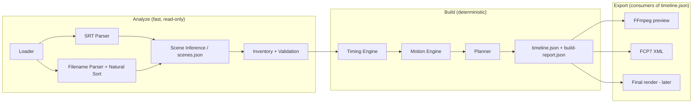

# ImgToVideo — Consolidated Plan v1.0

Deterministic desktop tool. **One job:** drop `narration.mp3`, `narration.srt`, and correctly
named images into a folder → click once → get a watchable rough cut with natural motion, plus an
editable Premiere timeline.

Not an AI editor, not a compositor, not a subtitle tool. Deterministic in, deterministic out.

## 1. Success criteria (v1 exit test)

1. Same inputs → byte-identical `timeline.json` (determinism)
2. Sum of clip coverage equals audio duration exactly (no gaps, no overlaps)
3. No auto-selected motion repeats consecutively; movement within stated ranges
4. FCP7 XML opens in Premiere with correct order, timing, tracks — and motion keyframes if the
   phase-0 spike succeeds
5. Preview renders in less time than the video itself runs

## 2. Fixed constants

| Constant | Value | Notes |
|---|---|---|
| Resolution | 1920×1080 | |
| FPS | 30 | Everywhere: JSON, FFmpeg, Premiere sequence |
| Pixel format | yuv420p | Compatibility |
| Duration min / preferred / max | 2.5 / 5.0 / 8.0 s | |
| Overflow floor | 2.0 s | Over-packed scenes shrink to this before erroring |
| Crossfade | 0.5 s, toggleable | Centered on the cut — see §6 |
| Motion vocabulary | `ST, ZI, ZO, PL, PR, PV` | One enum used in filenames, JSON, and code |

## 3. Motion codes are composition contracts

The suffix is decided at image-generation time, when the composition is known. It is **binding**:
the pixels only work with that motion. Generation rules and minimum dimensions are in
`docs/generation-spec.md`.

Motion priority:

1. Explicit code suffix (`_PR`, `_PV`, ...) → binding. The engine must use it.
2. No suffix → auto-selection state machine, conservative amplitudes (image assumed to have the
   standard 120% margin).

The "no immediate repeat" rule applies to auto-selected motion only. Two consecutive `_PR` files
are authorial intent — honored, logged as INFO.

## 4. Folder contract (convention over configuration)

```
Video_003\
├── audio\narration.mp3        (or narration.mp3 in root — loader checks both)
├── narration.srt
├── images\S01_01.png ...
├── scenes.json                (optional scene map — exact override)
├── imgtovideo.json            (optional project settings: durations, toggles)
└── out\                       (ALL generated artifacts, gitignored)
    ├── timeline.json          (source of truth)
    ├── build-report.json      (per-run decisions + diagnostics)
    ├── preview.mp4
    └── premiere.xml
```

No `imgtovideo.json` → defaults from §2. No `scenes.json` → scenes are inferred (§7.3).

## 4b. Settings model

Every constant in §2 is a default, not a hardcode. `ProjectOptions` (saved as `imgtovideo.json`,
snake-case, `schema_version`-checked like the timeline) groups:

| Group | Covers |
|---|---|
| `TimingOptions` | min / preferred / max / floor image durations |
| `MotionOptions` | auto-motion on/off, push-in and zoom-out percent ranges, pan travel cap, static cadence |
| `TransitionOptions` | enabled, kind, duration |
| `NamingOptions` | scene prefix, number padding, separator, motion codes on/off, image extensions |
| `RenderOptions` | preview size/preset/CRF, ffmpeg/ffprobe paths |
| `OutputOptions` | width/height/fps |

Rules:

- The filename **structure** `PREFIX{scene}_{index}(_{CODE})` is fixed; only prefix, padding,
  separator, extensions, and code on/off are configurable. Free-form naming patterns are
  deliberately rejected — the parser builds its regex from `NamingOptions` and validates itself
- `ProjectOptions.Validate()` enforces sanity (floor ≤ min ≤ preferred ≤ max, even output dims,
  positive durations, CRF range, cadence bounds); the UI shows these before allowing a build
- The WPF settings page (phase 11) binds directly to this model — the "effects" and "file naming"
  pages are just editors for `MotionOptions`/`TransitionOptions`/`TimingOptions` and
  `NamingOptions`, with `FormatExample()` as the live filename preview
- Global app defaults (future) layer under project options with the same schema

## 5. Architecture

```
ImgToVideo.sln
├── src\ImgToVideo.Core        models, parsers, inference, timing, motion,
│                             planner, validation  (no WPF, no process spawns)
├── src\ImgToVideo.Ffmpeg      pure arg-generation + thin process runner
├── src\ImgToVideo.Premiere    FCP7 XML writer
├── src\ImgToVideo.CapCut      CapCut draft exporter (tier 2 — spike-gated)
├── src\ImgToVideo.Cli         optional headless driver (batch later)
└── src\ImgToVideo.App         thin WPF shell
tests\ImgToVideo.Core.Tests
```

Two distinct phases with a hard boundary:



`Inventory` is an immutable snapshot; Build never touches the filesystem for decisions. The WPF UI
stays trivial and a future CLI is free.

## 6. Data model

**Time is frame-quantized.** Raw `double` seconds drift against Premiere's frame grid. The model
stores frames (`long`); JSON stores frames + fps (authoritative and unambiguous); the planner
quantizes every boundary via `round(seconds × fps)`.

**Scene layer exists** — every diagnostic is scene-level: `Timeline → Scene[] → VideoClip[]`.

**Viewport rectangles replace abstract scale/position.** Variable image sizes (per motion code)
make percent-based scale ambiguous. The canonical form is a viewport rect in source-image pixel
coordinates:

```csharp
public class VideoClip
{
    public string FilePath { get; set; }
    public string SceneId { get; set; }
    public long StartFrame { get; set; }
    public long DurationFrames { get; set; }
    public MotionType Motion { get; set; }         // ST, ZI, ZO, PL, PR, PV
    public MotionSource MotionSource { get; set; } // ExplicitCode | AutoSelected
    public Rect StartViewport { get; set; }        // x, y, w, h in source pixels
    public Rect EndViewport { get; set; }
    public TransitionIn? Transition { get; set; }  // kind + duration frames
}
```

- `ST` = identical start/end rect; `ZI` = shrinking rect; `PL/PR/PV` = full-height rect sliding
  horizontally
- The planner computes rects from the image's **actual** dimensions, clamped inside bounds — a pan
  that reveals an edge is impossible to specify
- Invariant: start/end rects must lie fully within the source image
- FFmpeg generator converts rects → `crop` expressions; Premiere exporter converts rects → Motion
  scale/position keyframes. Both derive from one truth

**Filename grammar (formal, case-insensitive on Windows):**

```
S{scene:2d}_{index:2d}(_{CODE})?.png      CODE ∈ {ST, ZI, ZO, PL, PR, PV}
```

`S08_02_PR.png` → scene 8, image 2, explicit pan-right contract. Natural sort on scene and index
as numbers (`S01_10` sorts after `S01_02`).

## 7. Pipeline rules

### 7.1 Timing engine

Scene windows are **hard boundaries** anchored to narration time. Scene of duration *D* with *n*
images:

| Condition | Behavior |
|---|---|
| `min ≤ D/n ≤ max` | Equal split |
| `D/n < min` | Shrink toward 2.0 s floor + WARNING; if even `floor × n > D` → ERROR (too many images) |
| `D/n > max` | Each clip capped at max; remainder added to the **last clip of the scene** (no black gaps) |

Additional rules:

- Audio is the master clock: timeline starts at 0 (even if the first subtitle starts late) and
  ends at audio end; the final image holds through trailing silence
- Transitions: crossfade centered on each cut — `t/2` carved from the outgoing tail, `t/2` from
  the incoming head. Cut points never move, so the coverage invariant survives transitions
- **Invariant (tested, not hoped for):** quantized clip coverage ≡ audio duration, zero gaps,
  zero overlaps

### 7.2 Motion engine

Deterministic state machine —
`SelectMotion(previous, positionInScene, shotsSinceStatic, overrideSuffix)`:

1. Explicit filename suffix always wins
2. Never repeat the previous motion (auto-selected only)
3. After `PL` prefer `ST, PR, ZI`; after `ZI` prefer `ST, PR, ZO`
4. A static shot at least every 4–6 shots
5. Scene-establishing shot is `ST` or `ZI`; first shot of the video is `ZI`; final shot is `ST`
   or `ZO`
6. Same input graph → same output, always (no RNG anywhere)

`PV` direction — DEFAULT: chosen by the same continuity rules as auto-selection (avoid repeating
the previous pan direction; default left-to-right when unconstrained). Narration-tied reveals are
a v2 override, not v1.

Amplitude is always derived from real pixel travel, not hardcoded percentages.

Unknown code (`_XX`) → WARNING, treated as unsuffixed (auto-select). Never guessed as ST.

Known limitation, accepted for v1: motion is center-based and composition-blind. It works only
because image generation maintains safe space around subjects. Subject-aware framing is v3+.

### 7.3 Scene inference — the default when `scenes.json` is absent

Scenes are inferred from the SRT by grouping subtitle blocks into sentences (punctuation +
inter-block gaps > 0.8 s), then packed into scene windows matching the image filename prefixes
present. `scenes.json` is the exact override; its schema gets validation too (overlaps, gaps,
out-of-audio-range → WARNING/ERROR). Sentence-grouping will misfire on odd punctuation — by
design it fails safe (produces scenes + a WARNING).

## 8. Validation catalog

| Severity | Checks |
|---|---|
| **ERROR** | Missing/unparsable audio; unparsable SRT; zero images; scene with zero images; scene over-packed beyond 2.0 s floor; ffmpeg/ffprobe not found; timeline ≠ audio duration (planner bug) |
| **WARNING** | Scene density below min; hold longer than max; duplicate stems; unknown motion suffix; `scenes.json` overlaps/gaps; image smaller than code minimum; PR/PL file with normal-composition width; non-16:9 aspect; SRT extends past audio; images matching no scene; non-PNG inputs |
| **INFO** | Static shot inserted; explicit-code clips (audit list); per-scene density summary; floor-shrink adjustments |

Only ERROR blocks a build. Messages always include the file path and an actionable fix.

## 9. Rendering strategy

One giant FFmpeg invocation fails on Windows (≈32k command-line limit) and is fragile at ~94
inputs. Architecture:

1. Render each clip as its own segment (`zoompan`/`crop` with the supersample trick — scale to
   ~2× before motion, then downscale, to kill integer-rounding jitter)
2. Segments in parallel (2–3 workers), progress aggregated, cancellation honored
3. Transitions rendered as small pairwise joins (or in-connector renders), then concat demuxer
4. Narration muxed into the preview — pacing checks must include audio
5. Preview at 960×540, `-preset veryfast -crf 28` — it exists to judge pacing, not quality

FFmpeg command generation is a pure function: `Args(Timeline, options) → string[]`, unit-tested
without ever spawning a process.

**Captions:** never burned into v1 output. Premiere imports SRT natively; the SRT is metadata in
`timeline.json` only.

## 10. Phases with acceptance criteria

| # | Phase | Done when |
|---|---|---|
| 0 | **Spike: FCP7 XML keyframes** — hand-write xmeml with scale/position keyframes, import to Premiere | Motion survives import, or fallback decision recorded (cuts-only XML) — *before* committing to the export design |
| 0b | **Spike: CapCut draft import** — study the installed CapCut version's `draft_content.json`, generate a two-clip draft externally | CapCut shows the draft with correct clips/timing, or tier 2 is rejected and tier 1 (MP4 + SRT) is the committed CapCut path |
| 1 | Core models + timeline.json writer/reader | Round-trip test; unknown `schemaVersion` rejected; byte-identical output |
| 2 | SRT parser | Edge-case corpus passes (BOM, CRLF, multi-line, overlaps, hours ≥ 1) |
| 3 | Filename parser + natural sort | `S01_10` sorts after `S01_02`; codes parsed; junk files rejected |
| 4 | Scene inference + scenes.json override | Fixture project maps correctly; override wins |
| 5 | Timing engine | Coverage invariant holds under property tests in all three density branches |
| 6 | Motion engine | No consecutive auto repeats; static cadence; full determinism test |
| 7 | Planner | `timeline.json` + `build-report.json` byte-identical across runs |
| 8 | FFmpeg renderer | 10-min fixture previews correctly with audio, progress, cancel |
| 9 | Transitions | Crossfades present, coverage invariant still holds |
| 10 | Premiere exporter | Spike-quality XML generated from real project; import verified |
| 10b | CapCut export | Tier 1: final-quality render + SRT copy produced by one click. Tier 2 (if 0b passed): draft exporter verified against real CapCut import |
| 11 | WPF shell + settings pages | The mocked UI, async with progress/cancel; settings pages edit `ProjectOptions` (effects, timing, naming with live `FormatExample()` preview) and persist to `imgtovideo.json` |
| 12 | Manual overrides | Per-image suffix already in 3; per-clip duration/motion edits |

Phase 0 exists because the Premiere exporter is the only component whose feasibility can't be
proven by unit tests — retire that risk first.

## 11. Deliberately out of scope for v1

Music/SFX beds, ducking, burned captions, overlays, parallax, subject-aware framing, per-clip
visual editor, batch/multi-project. The model leaves doors open (`List<AudioTrack>`, scene map,
overrides) without building any of it.

## 13. Implementation notes (as-built)

Refinements made while implementing phases 1–7; these refine the rules above.

**Timing (§7.1)**
- Quantization is frame-first: scene boundaries are rounded to frames, then clip durations are
  computed as frame differences with remainder frames distributed to the earliest clips. The
  coverage invariant (first frame 0, contiguous, last frame = round(audioSeconds × fps)) holds
  exactly, by construction, not by rounding luck
- Over-max branch: the first n−1 clips are capped at max frames and the last clip receives the
  remainder (hold) — exactly one WARNING per sparse scene

**Motion (§7.2)**
- The auto-selection pool excludes `PV` — a reveal on a normal-composition image has almost no
  travel, so reveals are explicit-code only
- Static cadence: force a static shot at ≥ `StaticEveryMaxShots` (6) always, and at ≥
  `StaticEveryMinShots` (4) when the previous shot was a pan
- Viewport math: the 100% viewport is the central `imageHeight / 1.2` band, width = height ×
  output aspect — for spec-compliant images this is exactly 1920×1080 source pixels. Zoom to p%
  scales the viewport by 100/p. Explicit pans travel the full available width; auto pans are
  capped at `PanMaxTravelPercent` of output width. All rects are clamped inside the image; a
  viewport that cannot fit adds a WARNING
- Images below their code's minimum size render correctly but emit a WARNING ("movement range is
  limited") — graceful degradation instead of failure

**Scenes (§7.3)**
- Inference splits on gap > `SentenceGapSeconds` (0.8) OR sentence-terminal punctuation with gap
  > `TerminalPunctuationGapSeconds` (0.4); both configurable via `SceneInferenceOptions`
- Inferred windows are tiled: scene i's end extends to scene i+1's start (narration pauses belong
  to the previous scene), first scene starts at 0, last scene ends at audio end
- `scenes.json` overlap detection happens at parse time; gaps and lead/trail deviations are
  auto-fixed with WARNINGs

**Loader**
- Audio: `audio\narration.*` → `narration.*` in root → any audio file (INFO fallback)
- SRT: `narration.srt` → first `*.srt` natural-ordered (INFO fallback)
- Images: `images\` folder only, filtered by `NamingOptions.ImageExtensions`; duplicate stems keep
  the first file with a WARNING; dimensions are read from PNG/JPEG headers (no System.Drawing)

**Renderer (§9, phases 8–9)**
- Segment filter chain: lanczos pre-supersample (2× when source width < 3840) → `zoompan` with
  duration-frame count, output size/fps → `format=yuv420p` → libx264 with preview preset/CRF,
  `-frames:v` cap, `-an`
- `zoompan` math honors the viewport model exactly: zoom is hyperbolic
  (`zoompanZ = sourceWidth / viewportWidth(f)`, constant-velocity viewport motion) evaluated from
  the clip's frame grid `(on + pieceStart)`; x/y are viewport-center based with `min/max` clamps
  so per-frame integer rounding can never reveal an edge; extrapolation past a clip's frame range
  is the same linear formula, which is what makes join windows possible
- All generated numbers use invariant culture — locale-safe argument strings
- **Transitions:** each cut with a `Crossfade` transition of J frames becomes a join segment that
  renders BOTH sides over the window `[cut − floor(J/2), cut + ceil(J/2))` — outgoing motion
  extrapolated past its end, incoming motion extrapolated before its start — blended by
  `xfade=transition=fade:duration=J/fps:offset=0`. Each clip renders only its exclusive range, so
  the assembled program length is exactly Σ(clip durations) — the coverage invariant survives
  rendering, not just planning. Cuts that would leave a clip with no exclusive frames fall back
  to hard cuts
- Progress: segments emit `-progress pipe:1`; `PreviewRenderService` runs segments with bounded
  parallelism (default 2 workers) and reports frame-weighted progress; cancellation kills the
  process tree
- Assembly: concat demuxer (`-c copy`, pieces are pre-trimmed so no mid-file cuts needed) → mux
  narration (`aac 192k`, `-shortest`)
- ffmpeg missing → actionable error naming the settings path; integration tests self-skip until
  ffmpeg is on PATH, then exercise a real 2-second render (with a crossfade) end to end

**Premiere exporter (§12, phase 10)**
- `Fcp7XmlExporter` emits xmeml v5: one sequence (project resolution/fps), V1 with one clipitem
  per clip (`in 0 / out D / start/end` from the timeline), A1 with the narration spanning the
  timeline, `pathurl` as `file://localhost/` URIs with escaped segments
- Motion keyframes (Premiere convention, pending spike validation): `scale = sourceWidth × 100 /
  viewportWidth` — identical to the renderer's zoom × 100; position in UI pixels
  (frame center 960/540 origin, y down): `horiz = 960 + (sourceWidth/2 − viewportCenterX) ×
  (1920/viewportWidth)`, vert analogous. Image travel is exactly opposite the viewport travel
- Keyframes at `when` 0 and D−1, linear interpolation; rotation emitted constant 0
- `IncludeMotionKeyframes = false` produces the cuts-only fallback XML (no effect elements) —
  this is the recorded fallback if the phase-0 spike shows Premiere drops imported keyframes
- Built with System.Xml.Linq, so names/paths are XML-escaped by construction

## 12. Export targets reality

### Premiere Pro (primary "editable timeline" target)

- `.prproj` is binary — not practically writable
- EDL carries no motion
- AAF into Premiere is unreliable for video with keyframes
- **FCP7 XML (`xmeml` v5)** imports natively and supports scale/position keyframes via the Basic
  Motion filter — fiddly but real, hence the phase-0 spike

### CapCut (secondary target — two tiers)

CapCut has **no official timeline interchange** (no XML/EDL/AAF import). Export strategy:

- **Tier 1 (committed):** full-quality MP4 render + the SRT for captions. Drop into CapCut and
  refine on top — the edit decisions are already baked in. Nearly free: the FFmpeg render pipeline
  exists for preview anyway; this is the same graph at final quality
- **Tier 2 (best-effort, spike-gated):** CapCut desktop drafts are JSON (`draft_content.json`,
  community reverse-engineered — the pyJianYingDraft project proves the approach).
  Version-fragile and unsupported by CapCut, so it gets its own feasibility spike (phase 0b) and
  ships only if the spike proves a stable subset (cuts + media refs + motion keyframes).
  Exporters are pure consumers of `timeline.json`, so this slots in as `ImgToVideo.CapCut`
  without touching anything else
